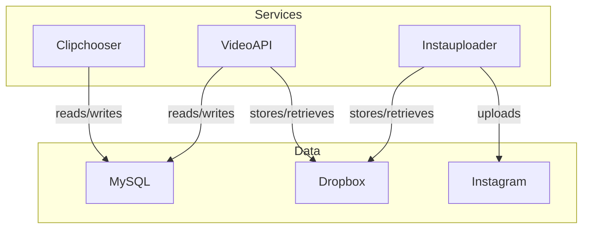
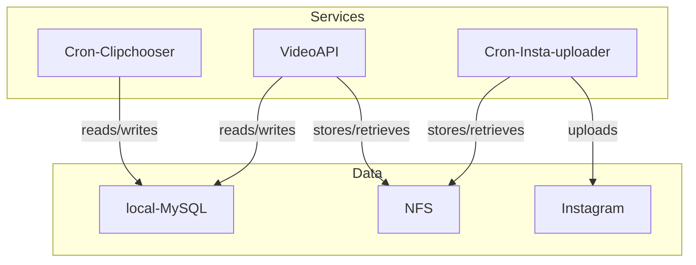

# Architecture Diagram

## Current Architecture

## Purposed Architecture

### TODO
1. Fix local mysql installation in helm
2. Fix NFS or other filesystem in cluster
3. Rebuild app so it connects to filesystem
